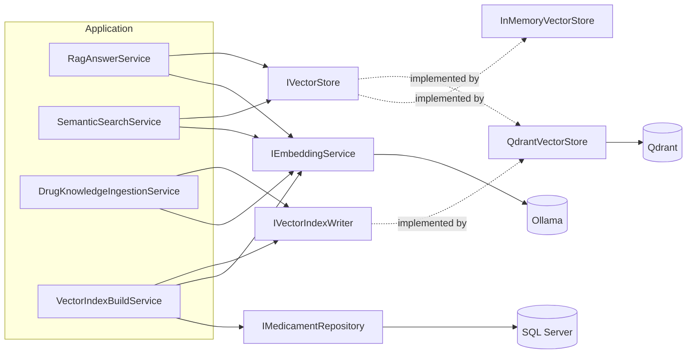

# DrugExplorer Backend

## Overview

The backend is a layered .NET solution:

```text
DrugExplorer.Api -> DrugExplorer.Application -> DrugExplorer.Domain
                         ^                         ^
                         |                         |
                Persistence / Infrastructure ------
```

`Domain` has no dependencies on other layers. `Application` owns business orchestration and interfaces. `Persistence` owns EF Core and SQL Server. `Infrastructure` owns external HTTP clients, mappings, and vector-search implementations. `Api` owns HTTP, DTOs, middleware, and dependency-injection wiring.

## Projects

| Project | Responsibility |
|---|---|
| `src/DrugExplorer.Api` | Controllers, HTTP DTOs, API mappings, middleware, `Program.cs` |
| `src/DrugExplorer.Application` | Services and interfaces; no HTTP or EF Core references |
| `src/DrugExplorer.Domain` | Entities, enums, value objects, domain models, exceptions |
| `src/DrugExplorer.Persistence` | `DrugExplorerDbContext`, migrations, SQL repositories |
| `src/DrugExplorer.Infrastructure` | OpenFDA, Ollama, vector stores, external mappings |
| `tests/DrugExplorer.Tests` | MSTest unit and integration tests |

## Main endpoints

Base route: `api/drugs`

| Method | Route | Application service | Purpose |
|---|---|---|---|
| `GET` | `/search?query=` | `IDrugSearchService` | OpenFDA search, grouping, caching, history, background ingestion |
| `GET` | `/semantic-search?query=&topK=` | `ISemanticSearchService` | Embedding-based search over drug chunks |
| `POST` | `/ask` | `IRagAnswerService` | Grounded answer from retrieved label chunks |
| `POST` | `/seed-medicaments?targetCount=` | `IMedicamentSeedService` | Bulk-populate the Drugs table from OpenFDA |
| `POST` | `/build-vector-index` | `IVectorIndexBuildService` | Embed every Drugs chunk missing from Qdrant, one by one; idempotent |
| `GET` | `/analytics` | search-history repository | Aggregate search metrics |

Swagger is available at `/swagger` when the API is running.

## Current runtime wiring

- SQL Server stores `Drugs` (source data) and `DrugEmbeddings` (written by search-time ingestion).
- `QdrantVectorStore` implements both `IVectorStore` (`CountAsync`, `SearchAsync`) and `IVectorIndexWriter` (`EnsureCollectionAsync`, `GetExistingIdsAsync`, `UpsertAsync`) over the Qdrant REST API.
- Qdrant collection `drug_chunks`: 768 dimensions, `Cosine` distance; payload `DrugKey`, `BrandName`, `GenericName`, `ChunkType`, `ChunkText`. Point id is a deterministic GUID from `DrugKey` + `ChunkType` (`DrugChunks.BuildPointId`).
- Config section `Qdrant`: `BaseUrl`, `CollectionName`, `VectorSize`, `TimeoutSeconds`, `ApiKey`.
- `InMemoryVectorStore` still exists as `IReloadableVectorStore` (adds `ReloadAsync`) but is not registered in DI.
- `OllamaEmbeddingClient` uses `nomic-embed-text` at `http://localhost:11434/`.
- `OllamaChatClient` uses `qwen2.5:1.5b`; its timeout is 180 seconds because model loading can be slow.
- OpenFDA is accessed through a typed client with a 10-second timeout.

Startup applies EF migrations and then ensures the Qdrant collection exists; if Qdrant is unreachable it only logs a warning. An existing collection with a different size or distance throws.

Ollama and Qdrant must both be running for embedding, search and RAG. The collection stays empty until `POST /api/drugs/build-vector-index` (or search-time ingestion) populates it.

## Request flows

### Drug search

`DrugsController` -> `DrugSearchService` -> normalization -> memory cache -> OpenFDA on cache miss -> grouping. A cache miss also starts bounded background knowledge ingestion in its own DI scope. Ingestion extracts label sections, deduplicates `(DrugKey, ChunkType)`, creates Ollama embeddings, writes SQL, and upserts the points to Qdrant.

### Vector index build

`VectorIndexBuildService` pages through `Drugs` (100 per page, ordered by `Id`), builds chunks per drug, skips empty text and ids already in Qdrant (one batch existence check per page), then embeds and upserts each missing chunk individually. Per-chunk failures are logged and counted. Returns `DrugsScanned`, `ChunksEmbedded`, `ChunksSkippedExisting`, `ChunksFailed`.

### Semantic search

`SemanticSearchService` embeds the query, asks `IVectorStore.SearchAsync` (Qdrant) for `topK * 5` cosine-similarity hits, groups hits by `DrugKey`, keeps the best hit per drug, and returns the requested number of drug results.

### RAG ask

`RagAnswerService` embeds the question, retrieves up to five chunks, keeps hits with similarity at least `0.35`, and builds a cited prompt for Ollama. With no qualifying context it returns a non-grounded fallback instead of guessing. Successful answers include source chunk text and similarity values.

## Persistence

`DrugEmbeddings` has a unique index on `(DrugKey, ChunkType)`. Repositories use `DrugExplorerDbContext` directly; there is no generic repository abstraction.

## Error handling

`GlobalExceptionMiddleware` maps `ExternalApiException` to its configured HTTP status (normally 502), `SearchProcessingException` and `ArgumentException` to 400, and unexpected exceptions to 500. Responses include timestamp, trace ID, error code, and details.

## Vector-search architecture



- `IVectorStore` (read) has two implementations: `QdrantVectorStore` (active) and `InMemoryVectorStore` (kept for reference, not registered in DI; it also implements `IReloadableVectorStore`).
- `IVectorIndexWriter` (write) is implemented only by `QdrantVectorStore`.
- SQL Server holds the source data (`Drugs`); Qdrant holds vectors plus payload for retrieval.

## Configuration

Settings live in `src/DrugExplorer.Api/appsettings.json`. Put local overrides (for example the connection string) in `appsettings.Development.json`; see `appsettings.Development.json.example`.

| Key | Default | Meaning |
|---|---|---|
| `ConnectionStrings:DefaultConnection` | empty | SQL Server connection string |
| `Ollama:BaseUrl` | `http://localhost:11434/` | Ollama server |
| `Ollama:EmbeddingModel` | `nomic-embed-text` | Embedding model (768 dimensions) |
| `Ollama:ChatModel` | `qwen2.5:1.5b` | Chat model for RAG answers |
| `Qdrant:BaseUrl` | `http://localhost:6333/` | Qdrant REST endpoint |
| `Qdrant:CollectionName` | `drug_chunks` | Collection used for drug chunks |
| `Qdrant:VectorSize` | `768` | Must match the embedding model output |
| `Qdrant:TimeoutSeconds` | `30` | HTTP timeout for Qdrant calls |
| `Qdrant:ApiKey` | empty | Sent as the `api-key` header when set |
| `CacheSettings:EnableCaching` / `SearchCacheTtlMinutes` | `true` / `10` | Search result caching |

If you change the embedding model, change `Qdrant:VectorSize` and use a new collection name (or delete the old collection), because an existing collection with a different size makes startup validation fail.

## Running locally

Prerequisites: .NET 8 SDK, SQL Server, Ollama, and Qdrant.

1. **Qdrant** (WSL distro `DrugExplorerUbuntu`, binary in `/opt/qdrant`). Run from any PowerShell window and keep it open:
   ```powershell
   wsl -d DrugExplorerUbuntu --cd /opt/qdrant -- ./qdrant
   ```
   Data is stored in `/opt/qdrant/storage`. Check: `Invoke-RestMethod http://localhost:6333/collections`. Dashboard: `http://localhost:6333/dashboard`.
2. **Ollama**:
   ```powershell
   ollama pull nomic-embed-text
   ollama pull qwen2.5:1.5b
   ollama serve   # not needed if the Ollama tray app is running
   ```
   Check: `Invoke-RestMethod http://localhost:11434/api/tags`.
3. **API** (from `DrugExplorer/`). Startup applies EF migrations and ensures the Qdrant collection exists:
   ```powershell
   dotnet run --project src/DrugExplorer.Api/DrugExplorer.Api.csproj
   ```
   URLs: `https://localhost:7219` and `http://localhost:5034`. Swagger: `/swagger`.
4. **Fill SQL** if the `Drugs` table is empty: `POST /api/drugs/seed-medicaments?targetCount=1000`.
5. **Fill Qdrant**: `POST /api/drugs/build-vector-index`. This embeds every chunk missing from Qdrant, one at a time. It is slow on CPU and blocks until finished; progress is logged. Re-running is safe because existing points are skipped.
   ```powershell
   Invoke-RestMethod -Method Post http://localhost:5034/api/drugs/build-vector-index -TimeoutSec 0
   ```
   The response contains `DrugsScanned`, `ChunksEmbedded`, `ChunksSkippedExisting` and `ChunksFailed`.

## Testing

### Automated tests

```powershell
dotnet test tests/DrugExplorer.Tests/DrugExplorer.Tests.csproj
```

MSTest with Moq. Unit tests are in `tests/DrugExplorer.Tests/UnitTests` and need no external services.

### Manual checks against Qdrant

Collection name is `drug_chunks`.

```powershell
# Collection info (vector size, distance, points_count)
Invoke-RestMethod http://localhost:6333/collections/drug_chunks

# Exact point count
Invoke-RestMethod -Method Post http://localhost:6333/collections/drug_chunks/points/count `
  -ContentType 'application/json' -Body '{"exact":true}'

# Browse stored points (payload only)
Invoke-RestMethod -Method Post http://localhost:6333/collections/drug_chunks/points/scroll `
  -ContentType 'application/json' -Body '{"limit":3,"with_payload":true,"with_vector":false}' |
  ConvertTo-Json -Depth 8

# Similarity search: embed the query with Ollama, then search
$v = (Invoke-RestMethod -Method Post http://localhost:11434/api/embeddings `
  -ContentType 'application/json' `
  -Body '{"model":"nomic-embed-text","prompt":"side effects of ibuprofen"}').embedding
$body = @{ vector = $v; limit = 3; with_payload = $true } | ConvertTo-Json -Depth 3
Invoke-RestMethod -Method Post http://localhost:6333/collections/drug_chunks/points/search `
  -ContentType 'application/json' -Body $body | ConvertTo-Json -Depth 8
```

`score` is cosine similarity; the RAG service ignores hits below `0.35`.

To reset the index (the collection is recreated on the next API start or build run):

```powershell
Invoke-RestMethod -Method Delete http://localhost:6333/collections/drug_chunks
```

### End-to-end through the API

```powershell
Invoke-RestMethod "http://localhost:5034/api/drugs/semantic-search?query=pain relief&topK=5"
Invoke-RestMethod -Method Post http://localhost:5034/api/drugs/ask `
  -ContentType 'application/json' -Body '{"question":"Can ibuprofen be used during pregnancy?"}'
```

The first `ask` after Ollama starts can be slow while the chat model loads. With an empty collection, both endpoints return an empty result or a non-grounded answer.

### Troubleshooting

| Symptom | Cause / fix |
|---|---|
| Startup warning "Qdrant collection check failed" | Qdrant is not running or `Qdrant:BaseUrl` is wrong |
| Startup throws about collection size/distance | Collection was created with a different `VectorSize`; delete it or use a new name |
| 502 from `ask`, `semantic-search` or the build endpoint | Ollama or Qdrant unreachable (`ExternalApiException`) |
| `ChunksFailed` > 0 | Chunk embedding failed (often text too long or Ollama down); see logs and re-run |
| `ask` always ungrounded | Collection empty or no hit reached similarity `0.35` |
| `dotnet build` fails with NU1301 / 401 | Private NuGet feed in `NuGet.config`; environment issue unrelated to the code |

## Useful commands

Run from `DrugExplorer/`:

```powershell
dotnet build DrugExplorer.sln
dotnet test tests/DrugExplorer.Tests/DrugExplorer.Tests.csproj
dotnet run --project src/DrugExplorer.Api/DrugExplorer.Api.csproj
```

Before using `dotnet run --no-build`, rebuild after code changes, migrations, or dependency changes so stale binaries are not mistaken for current behavior.

## Vector-search direction

Qdrant is installed in the WSL2 distribution `DrugExplorerUbuntu`, exposed at `http://localhost:6333`, and is now the active vector store. SQL Server remains the source of drug data. Remaining migration items (verification report, retries, integration tests, backup) are tracked in [qdrant-migration.md](qdrant-migration.md).
